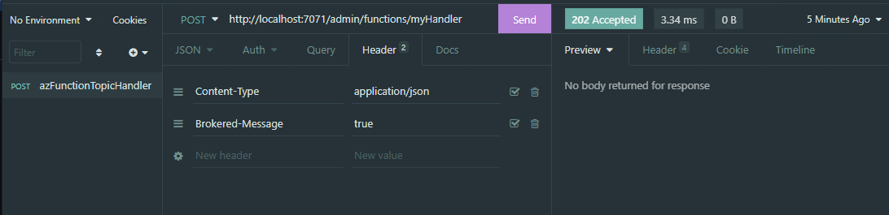

# insomnia-plugin-brokeredMessage
Insomnia plugin to re-format json body message as a BrokeredMessage in order to trigger Azure non-HTTP triggered Functions

## Issue this solves
Suppose you have an Azure Function that is triggered from an Azure Service Bus (queue or topic subscription). You want to test this (locally) and call the running Azure Function from Insomnia as it is described in the MS docs [here](https://docs.microsoft.com/en-us/azure/azure-functions/functions-manually-run-non-http).

The http post will call the local Azure Function, and you'll receive a 202 Accepted response. But in the function console, there's an error:


**Console Output from Function**
 
 `Unable to convert trigger to BrokeredMessage`


```
[2021-07-01T17:53:41.362Z] Executed 'Functions.bmsTicketHandler' (Failed, Id=xxx, Duration=133ms)
[2021-07-01T17:53:41.363Z] System.Private.CoreLib: Exception while executing function: Functions.myTopicHandler. Microsoft.Azure.WebJobs.Host: Exception binding parameter option binding parameter 'eventMsg'. Microsoft.Azure.WebJobs.ServiceBus: Unable to convert trigger to BrokeredMessage.
```

The function never hits a breakpoint when trying to debug - the post (our pseudo trigger) is never processed or accepted by the function.

## What to do

The fix is to wrap the ServiceBus message payload as an  `{input: <message>}` object.  Within the Azure function code, the [FunctionInvocation class](https://github.com/Azure/azure-functions-host/blob/f9540d6aaafc56ecd3d8d045edfc159a85ea9ba1/src/WebJobs.Script.WebHost/Models/FunctionInvocation.cs) is just a simple class with one attribute named `Input`.

Our effect is to call the function like this:

```
curl --request POST \
  --url http://localhost:7071/admin/functions/myHandler \
  --header 'Content-Type: application/json' \
  --data '{"input": "{\"eventType\":1,\"statusType\":2,"id\":177638636663,"name\":\"container-ue-1\"}"}'

```

However - having to serialize & wrap you message object every time needs a helper of some sort.  Insomia's plugins to the rescue!

Once this plugin is installed, simply set a header `Brokered-Message = true` on any requests to be re-formatted.



## Install Plugin

Plugins can be added from the Plugins tab within the application preferences dialog. They can also be downloaded and installed directly from [npm](https://www.npmjs.com/), or directly from Insomina Plugin Hub.

> To install it go to Application > Preferences > Plugins, type the package name "insomnia-plugin-brokeredmessage" and hit Install Plugin. That's it!

Once installed, simply set the header `Brokered-Message = true` on any *JSON* message requests to be re-formatted.

If you found this helpful...
 
<a href="https://www.buymeacoffee.com/jwstott" target="_blank"></a>

## Ref's
[Insomnia Plugins](https://support.insomnia.rest/article/173-plugins)  
[Manually Run non-http functions](https://docs.microsoft.com/en-us/azure/azure-functions/functions-manually-run-non-http)  
[Functions Code](https://github.com/Azure/azure-functions-host/blob/f9540d6aaafc56ecd3d8d045edfc159a85ea9ba1/src/WebJobs.Script.WebHost/Models/FunctionInvocation.cs)  